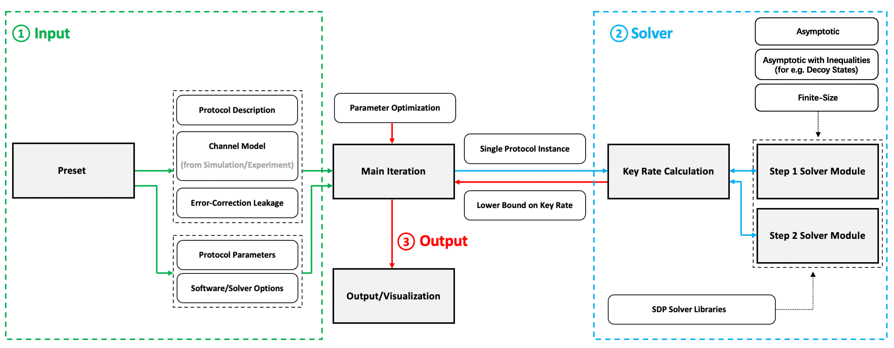

# OpenQKDSecurity Platform

OpenQKDSecurity is a MATLAB-based software platform for numerical key rate calculation of Quantum Key Distribution (QKD) protocols.

The code is categorized into four types: 
- description files that contains information for the protocol and channel (in Protocols folder), 
- solver modules performing two-step numerical calculation of key rate for a given protocol instance (in Solvers folder), 
- preset combinations of protocols, solver modules, and parameters/options (in Presets folder)
- the interfaces and the main iteration (in root folder).

Users supply description for the protocol in the Protocols folder, specify a solver module to use from the Solvers folder, as well as provide appropriate running parameter/options. All the above information is specified in a preset file. One then chooses a preset in the entry-point file main.m and run this file to calculate key rate.

Please refer to the **user guide** (which is provided as a PDF file) for detailed instructions on using the code.

## Installation

To install the package, simply download the entire repository and unzip to a preferred directory.

Before running the program, one needs to install the dependencies too:
- Our QKD toolbox relies on CVX for convex optimization. Please download CVX from http://cvxr.com/cvx/download. Once downloaded and unzipped in a directory, please either set the directory as work directory in MATLAB, or add it to the MATLAB path using 

    ```
	addpath(genpath('CVX_DIRECTORY'))
    ```

	Afterwards, one can run

	```
	cvx_setup
	```

	to correctly set up CVX and let it automatically find available solvers (e.g. if one wants to use the additional Mosek SDP backend solver instead of the default SDPT3 backend SDP solver, one would have to first install Mosek with license, and add Mosek path to the MATLAB working path - alternatively, one can request CVX for an academic license which includes Mosek). Some of our protocols run better with Mosek than SDPT3.

After dependencies are installed, one can edit main.m, and select one of the presets which already contains a combination of protocol, channel, solver module, as well as the appropriate parameters and options. An example would be

```
preset='pmBB84_asymptotic';
```

or choose the 'custom' preset and edit the input files manually. 

Once the preset is chosen, simply set the current directory and all its subfolders as the MATLAB working directory, and run the main.m program to start the software. Alternatively, one can uncomment the automatic path-setting code in main.m, for instance:

```
restoredefaultpath;
addpath(genpath('.'))
addpath(genpath('C:\cvx2')) %sample cvx directory
addpath(genpath('C:\Program Files\Mosek\9.2\toolbox\R2015a')) %sample external mosek directory
```

(***NOTE**: using ```restoredefaultpath``` will clear out other dependencies too, so use this code carefully if you have other libraries installed - either set directory via the GUI each time, or manually add other library dependencies using addpath too.)


## Architecture


The platform is modularized by design, with three main parts: 
- input files (protocol description and channel model, as well as parameters/options, are all combined in a preset)
- solver module (here two modules are used for the first and second step process to bound the key rate)
- main iteration (which scans over range of specified parameters, or optimize over given optimizable parameters)

The modules accepts and returns given interfacing data formats (for details please refer to the user guide), and otherwise treat the other modules as decoupled black boxes, making swapping between modules convenient.

## Current Status

Currently in the package we provide three protocols:

- BB84 (with single photon source, and with phase-randomized weak coherent pulse source + decoy states)
- Measurement-Device-Independent QKD (with single photon source, and with phase-randomized weak coherent pulse source + decoy states)
- Discrete-Modulated Continuous Variable QKD

There are also three solver modules included:
- Asymptotic solver
- Asymptotic solver with inequalities (for e.g. decoy states)
- Finite-size solver

We plan to gradually add in more protocols and solver modules in the future, and also welcome contributors too add in their own protocols and solver modules.

## Custom Usage

Besides running given protocols with different parameters or experimental data for the channel, the two custom user scenarios are:

- User can provide a new protocol description to estimate its key rate. A protocol description (and its accompanying channel model) can work with existing solver modules as long as it includes the necessary interfaces (the list of used parameters ``varNames`` for all files, ``krausOp,keyMap,observables`` for protocolDescription and ``expectations,pSift,errorRate`` for channelModel - for details on what they mean and how to supply the data, please refer to the user guide for details).

- User can provide a new solver module to estimate the key rate of existing protocol descriptions. A solver module can work with existing protocols as long as it takes in the data ``krausOp,keyMap,observables,expectations`` and returns the optimized density matrix ``rho`` (for first step solver module) or bound on the key rate ``lowerBound`` (for second step solver module).

## Contributing

If you would like to contribute, please contact Prof. Lütkenhaus at lutkenhaus.office@uwaterloo.ca.

## License

OpenQKDSecurity is licensed under the MIT license. See LICENSE for details.

## Acknowlegements

This work has been performed at the Institute for Quantum Computing (IQC), which is supported by Innovation, Science and Economic Development (ISED) Canada. This research has been supported by NSERC Collaborative Research and Development (CRD) Program and Discovery Grants Program. Financial support for this project has been partially provided by Huawei Technologies Canada Co., Ltd.
